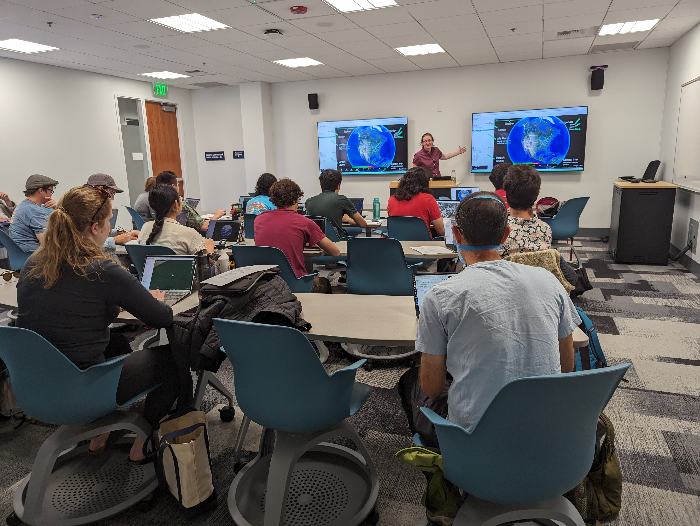

Workshops take place on <b>Fridays from 10:00-12:00</b>, unless otherwise indicated. Please note the location of each workshop. In-person workshops will typically be held in <b><a href="https://datalab.ucdavis.edu/location/">The DataLab Classroom,</a> room 360 Shields Library</b>. Most of our workshops will be fully in-person with no zoom option. We anticipate making videos of instructional workshops available on our <a href="https://www.youtube.com/@maptimedavis95616">YouTube Channel</a> after the end of the quarter for those who are unable to attend in person.

 

<h2>Schedule</h2>

Scroll down for event descriptions.

<table id="schedule" class="center">
	<colgroup>
		<col style="background-color:lightgray">
		<col style="background-color:#F4F4F4">
		<col style="background-color:lightgray">
	</colgroup>

	<tr>
		<th>Date</th>
		<th>Topic</th>
		<th>Speaker</th>
		<th>Location</th>
	</tr>
	
	<tr>
		<td>4/10/2026</td>
		<td>Work Session <a href='https://www.eventbrite.com/e/community-work-session-tickets-1986273507530?aff=oddtdtcreator'>RSVP</a></td>
		<td>Community Event</td>
		<td>DataLab Classroom - room 360 Shields Library</td>
	</tr>
	<tr>
		<td>4/17/2026</td>
		<td>Intro to QGIS: Rasters <a href='https://www.eventbrite.com/e/intro-to-qgis-rasters-tickets-1986263458473?aff=oddtdtcreator'>RSVP</a></td>
		<td>Lauren Mabe</td>
		<td>DataLab Classroom - room 360 Shields Library;   <a href="https://drive.google.com/file/d/1FhptIxNaZA2TJtgZXdxCygeoUkwAdsmL/view">Workshop Materials</a></td>
	</tr>
	<tr>
		<td>4/24/2026</td>
		<td>Work Session <a href='https://www.eventbrite.com/e/community-work-session-tickets-1986273507530?aff=oddtdtcreator'>RSVP</a></td>
		<td>Community Event</td>
		<td>DataLab Classroom - room 360 Shields Library</td>
	</tr>
	
	<tr>
		<td>4/24/2026 1:00-12:00</td>
		<td>Social @ Guads</td>
		<td>Community Event</td>
		<td>Guads at 231 3rd St. in Davis</td>
	</tr>
	
	<tr>
		<td>5/1/2026</td>
		<td>Field Data Collection <a href='https://www.eventbrite.com/e/field-data-collection-tickets-1986264576818?aff=oddtdtcreator'>RSVP</a></td>
		<td>Many (let us know if you want to share!)</td>
		<td>DataLab Classroom - room 360 Shields Library</td>
	</tr>
	<tr>
		<td>5/8/2026</td>
		<td>Work Session <a href='https://www.eventbrite.com/e/community-work-session-tickets-1986273507530?aff=oddtdtcreator'>RSVP</a></td>
		<td>Community Event</td>
		<td>DataLab Classroom - room 360 Shields Library</td>
	</tr>
	<tr>
		<td>5/15/2026</td>
		<td>Map Design & Cartography <a href='https://www.eventbrite.com/e/map-design-cartography-tickets-1986221855036?aff=oddtdtcreator'>RSVP</a></td>
		<td>Michele Tobias</td>
		<td>DataLab Classroom - room 360 Shields Library</td>
	</tr>
	<tr>
		<td>5/22/2026</td>
		<td>Work Session <a href='https://www.eventbrite.com/e/community-work-session-tickets-1986273507530?aff=oddtdtcreator'>RSVP</a></td>
		<td>Community Event</td>
		<td>DataLab Classroom - room 360 Shields Library</td>
	</tr>
	<tr>
		<td>5/29/2026</td>
		<td>Spatial SQL <a href='https://www.eventbrite.com/e/spatial-sql-tickets-1986273386167?aff=oddtdtcreator'>RSVP</a></td>
		<td>Alex Mandel, Naomi Kalman, Michele Tobias, Holden Tal</td>
		<td>DataLab Classroom - room 360 Shields Library</td>
	</tr>

</table>

<!--
	<tr>
		<td colspan="4">Tentative <b>FALL 2025 SCHEDULE</b> as of 8/19</td>
	</tr>

-->

<!-- Empty Row Template:
	<tr>
		<td>date</td>
		<td>talk title (RSVP link coming soon)</td>
		<td>speaker name</td>
		<td>DataLab Classroom - room 360 Shields Library</td>
	</tr>
-->

 

 

<h2>Descriptions</h2>

 

 

<h3>work session</h3>

<b>Date: </b>4/10/2026 10:00-12:00

<b>Location: </b>DataLab Classroom - room 360 Shields Library

<b>Description: </b>People working with geospatial data and methods are scattered across campus. Community Work Sessions are a chance to work on your geospatial projects in the same space with other geo people, get feedback, ask questions, and answer questions.

<b>Speaker: </b>Community

<b>Prerequisites: </b>No prior experience is required.

<b>Software Required: </b>Bring what you need.

<a href='https://www.eventbrite.com/e/community-work-session-tickets-1986273507530?aff=oddtdtcreator'>RSVP</a>

 

<h3>Intro to QGIS: Rasters</h3>

<b>Date: </b>4/17/2026 10:00-12:00

<b>Location: </b>DataLab Classroom - room 360 Shields Library

<b>Description: </b>Learn how to work with raster data in QGIS! We'll cover loading and symbolizing raster data as well as begin using raster analysis tools to gain confidence in working in QGIS. Our sample project will be a small Multi-Critera Analysis (MCA), a common raster-based spatial analysis.

<b>Speaker: </b>Lauren Mabe

Lauren is a PhD Candidate in the Geography Graduate Group and previously worked as a cartographer for Garmin Intl. Her research focuses on sustainable organic waste management systems in California. She uses many geospatial tools in her work and is passionate about good maps in research!

<b>Prerequisites: </b>No prior experience is required.

<b>Software Required: </b>QGIS: available for all major computer operating systems at qgis.org

<a href='https://www.eventbrite.com/e/intro-to-qgis-rasters-tickets-1986263458473?aff=oddtdtcreator'>RSVP</a>

 

<h3>work session</h3>

<b>Date: </b>4/24/2026 10:00-12:00

<b>Location: </b>DataLab Classroom - room 360 Shields Library

<b>Description: </b>People working with geospatial data and methods are scattered across campus. Community Work Sessions are a chance to work on your geospatial projects in the same space with other geo people, get feedback, ask questions, and answer questions.

<b>Speaker: </b>Community

<b>Prerequisites: </b>No prior experience is required.

<b>Software Required: </b>Bring what you need.

<a href='https://www.eventbrite.com/e/community-work-session-tickets-1986273507530?aff=oddtdtcreator'>RSVP</a>

 

<h3>Social @Guads</h3>

<b>Date: </b>4/24/2026 1:00-12:00

<b>Location: </b>Guads at 231 3rd St. in Davis

<b>Description: </b>Join the maptimeDavis community for a social gathering Guads on 3rd Street!

<b>Speaker: </b>Community

 

<h3>Field Data Collection</h3>

<b>Date: </b>5/1/2026 10:00-12:00

<b>Location: </b>DataLab Classroom - room 360 Shields Library

<b>Description: </b>This session will be a show-and-tell style discussion of field data collection tools. Bring your questions, stories, and/or collection tools to share.

<b>Speaker: </b>Community

<b>Prerequisites: </b>No prior experience is required.

<b>Software Required: </b>None.

<a href='https://www.eventbrite.com/e/field-data-collection-tickets-1986264576818?aff=oddtdtcreator'>RSVP</a>

 

<h3>work session</h3>

<b>Date: </b>5/8/2026 10:00-12:00

<b>Location: </b>DataLab Classroom - room 360 Shields Library

<b>Description: </b>People working with geospatial data and methods are scattered across campus. Community Work Sessions are a chance to work on your geospatial projects in the same space with other geo people, get feedback, ask questions, and answer questions.

<b>Speaker: </b>Community

<b>Prerequisites: </b>No prior experience is required.

<b>Software Required: </b>Bring what you need.

<a href='https://www.eventbrite.com/e/community-work-session-tickets-1986273507530?aff=oddtdtcreator'>RSVP</a>

 

<h3>Map Design & Cartography</h3>

<b>Date: </b>5/15/2026 10:00-12:00

<b>Location: </b>DataLab Classroom - room 360 Shields Library

<b>Description: </b>Making a map that communicates well is difficult. You likely spent a significant amount of time and energy planning and implementing your analysis and you want the resulting map to reflect that. In this workshop, we'll learn some guidelines for map visualilzations that communicate your intended message quickly and accurately.  We'll work in QGIS, but the concepts you learn in this workshop will apply to any map-making software and even to non-map figures like graphs.

<b>Speaker: </b>Michele Tobias

Michele Tobias is a geospatial data scientist with a background in geospatial methods for ecology. Michele earned her PhD from UC Davis in Geography where she studied California’s sandy beach ecosystem with traditional phytosociological methods and innovative remote sensing tools and was a postdoc at the UC Davis Information Center for the Environment. In her current position as a geospatial data scientist at the UC Davis Library, she applies geospatial tools to new avenues of research across disciplines.

<b>Prerequisites: </b>No prior experience is required, but familiarity with spatial data formats (raster and vector) is recommended.

<b>Software Required: </b>QGIS: available for all major computer operating systems at qgis.org

<a href='https://www.eventbrite.com/e/map-design-cartography-tickets-1986221855036?aff=oddtdtcreator'>RSVP</a>

 

<h3>work session</h3>

<b>Date: </b>5/22/2026 10:00-12:00

<b>Location: </b>DataLab Classroom - room 360 Shields Library

<b>Description: </b>People working with geospatial data and methods are scattered across campus. Community Work Sessions are a chance to work on your geospatial projects in the same space with other geo people, get feedback, ask questions, and answer questions.

<b>Speaker: </b>Community

<b>Prerequisites: </b>No prior experience is required.

<b>Software Required: </b>Bring what you need.

<a href='https://www.eventbrite.com/e/community-work-session-tickets-1986273507530?aff=oddtdtcreator'>RSVP</a>

 

<h3>Spatial SQL</h3>

<b>Date: </b>5/29/2026 10:00-12:00

<b>Location: </b>DataLab Classroom - room 360 Shields Library

<b>Description: </b>This workshop is intended to give participants an introduction to working with spatial data using SQL -- a database querying language. We will work with a graphical user interface (GUI) and explore some examples of common analysis processes as well as present participants with resources for continued learning. This workshop will give participants a solid foundation on which to build further learning.  By the end of this workshop, participants will be able to import data into a spatialite database, write queries to answer questions about spatial data, understand the difference between attribute queries and geometry queries, view spatial tables and views in QGIS, and use terminology related to spatial databases to facilitate future learning.

<b>Speaker: </b>Alex Mandel, Michele Tobias, Naomi Kalman, Holden Tal

This workshop will be taught by a team of instructors who use spatial SQL in their work and research.

<b>Prerequisites: </b>No prior experience is required, but familiarity with spatial data formats (raster and vector) is recommended.

<b>Software Required: </b>QGIS: available for all major computer operating systems at qgis.org

<a href='https://www.eventbrite.com/e/spatial-sql-tickets-1986273386167?aff=oddtdtcreator'>RSVP</a>

 
<h3>work session</h3>

<b>Date: </b>6/5/2026 10:00-12:00

<b>Location: </b>DataLab Classroom - room 360 Shields Library

<b>Description: </b>People working with geospatial data and methods are scattered across campus. Community Work Sessions are a chance to work on your geospatial projects in the same space with other geo people, get feedback, ask questions, and answer questions.

<b>Speaker: </b>Community

<b>Prerequisites: </b>No prior experience is required.

<b>Software Required: </b>Bring what you need.

<a href='https://www.eventbrite.com/e/community-work-session-tickets-1986273507530?aff=oddtdtcreator'>RSVP</a>

 

 

 

<!-- Descriptions Template:

<h3>title</h3>

<b>Date:</b> 10:00-12:00

<b>Location:</b>The Physical and Data Sciences Building, previously known as PSEL (Physical Sciences & Engineering Library) Seminar Room (room 1025)

<b>Description:</b> 

<b>Concepts Covered:</b> 

<b>Speaker:</b> 

speaker bio

<b>Prerequisites:</b> 

<a href="https://docs.google.com/forms/d/e/1FAIpQLScHMZF-hPnY3J6T0NAbkrGBxjP0Xsw1wwhJftdHBklnXiq3sg/viewform?usp=header">RSVP</a>

 

 

-->
