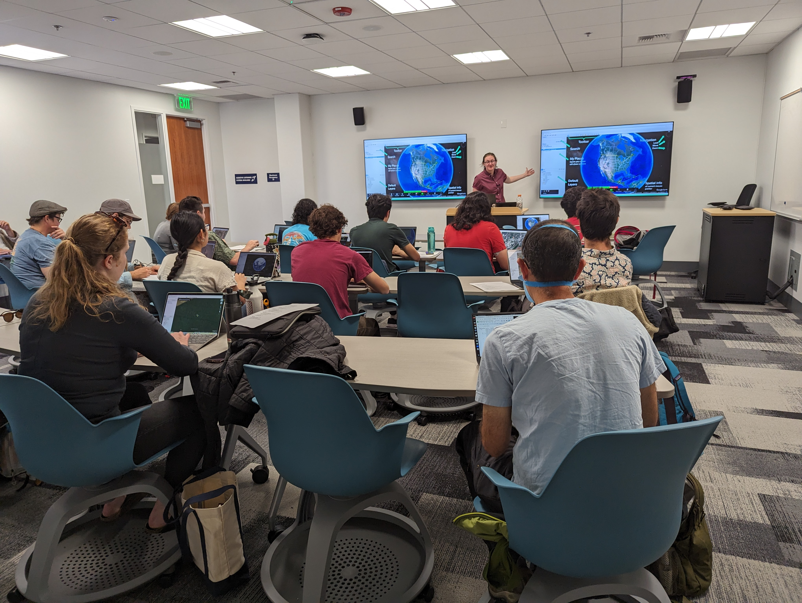

Workshops take place on <b>Fridays from 10:00-12:00</b>, unless otherwise indicated. Please note the location of each workshop. In-person workshops will typically be held in <b><a href="https://datalab.ucdavis.edu/location/">The DataLab Classroom,</a> room 360 Shields Library</b>. Most of our workshops will be fully in-person with no zoom option. We anticipate making videos of instructional workshops available on our <a href="https://www.youtube.com/@maptimedavis95616">YouTube Channel</a> after the end of the quarter for those who are unable to attend in person.

 

<h2>Schedule</h2>

Scroll down for event descriptions.

<table id="schedule" class="center">
	<colgroup>
		<col style="background-color:lightgray">
		<col style="background-color:#F4F4F4">
		<col style="background-color:lightgray">
	</colgroup>

	<tr>
		<th>Date</th>
		<th>Topic</th>
		<th>Speaker</th>
		<th>Location</th>
	</tr>

	
	<tr>
		<td>9/25/2026</td>
		<td>Community Work Session</td>
		<td>Community</td>
		<td>DataLab Classroom - room 360 Shields Library</td>
	</tr>
	
		<tr>
		<td>10/2/2026</td>
		<td>Map Room Tour</td>
		<td>Sheena Campbell & Michele Tobias</td>
		<td><b>Shield Library Map Collection</b> - room 93 Shields Library (lower level/basement)</td>
	</tr>
	
	<tr>
		<td>10/9/2026</td>
		<td>Community Work Session</td>
		<td>Community</td>
		<td>DataLab Classroom - room 360 Shields Library</td>
	</tr>
	
		<tr>
		<td>10/9/2026 5:00-7:00</td>
		<td>Social @ Pizza & Pints</td>
		<td>Community</td>
		<td><b>Pizza & Pints</b> - 236 B St, Davis </td>
	</tr>
	
	<tr>
		<td>10/16/2026</td>
		<td>Augmented Reality (AR) Mapping</td>
		<td>Oliver Kreylos</td>
		<td>DataLab Classroom - room 360 Shields Library</td>
	</tr>	
	<tr>
		<td>10/23/2026</td>
		<td>Community Work Session</td>
		<td>Community</td>
		<td>DataLab Classroom - room 360 Shields Library</td>
	</tr>
	<tr>
		<td>10/30/2026</td>
		<td>Accessibility in Mapping</td>
		<td>Josh Hori</td>
		<td>DataLab Classroom - room 360 Shields Library</td>
	</tr>
	<tr>
		<td>11/6/2026</td>
		<td>Community Work Session</td>
		<td>Community</td>
		<td>DataLab Classroom - room 360 Shields Library</td>
	</tr>
	<tr>
		<td>11/13/2026</td>
		<td>Into to QGIS</td>
		<td>Holden Tal</td>
		<td>DataLab Classroom - room 360 Shields Library</td>
	</tr>
	<tr>
		<td>11/20/2026</td>
		<td>UC GIS Week Humanitarian OpenStreetMap Map-a-Thon</td>
		<td>Naomi Kalman & Liam Bhajan</td>
		<td>DataLab Classroom - room 360 Shields Library</td>
	</tr>

</table>

<!--
	<tr>
		<td colspan="4">Tentative <b>FALL 2025 SCHEDULE</b> as of 8/19</td>
	</tr>

-->

<!-- Empty Row Template:
	<tr>
		<td>date</td>
		<td>talk title (RSVP link coming soon)</td>
		<td>speaker name</td>
		<td>DataLab Classroom - room 360 Shields Library</td>
	</tr>
-->

 

 

<h2>Descriptions</h2>

Workshop descriptions coming soon!

 

 

 

<!-- Descriptions Template:

<h3>title</h3>

<b>Date:</b> 10:00-12:00

<b>Location:</b>The Physical and Data Sciences Building, previously known as PSEL (Physical Sciences & Engineering Library) Seminar Room (room 1025)

<b>Description:</b> 

<b>Concepts Covered:</b> 

<b>Speaker:</b> 

speaker bio

<b>Prerequisites:</b> 

<a href="https://docs.google.com/forms/d/e/1FAIpQLScHMZF-hPnY3J6T0NAbkrGBxjP0Xsw1wwhJftdHBklnXiq3sg/viewform?usp=header">RSVP</a>

 

 

-->
